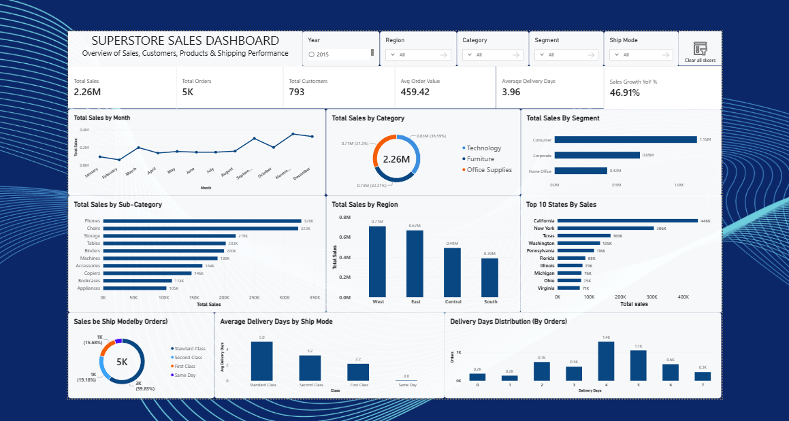
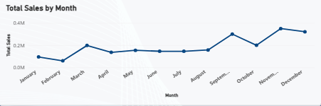
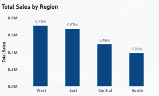
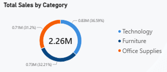
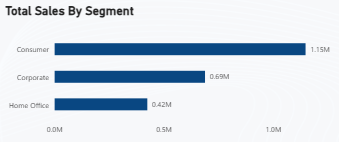
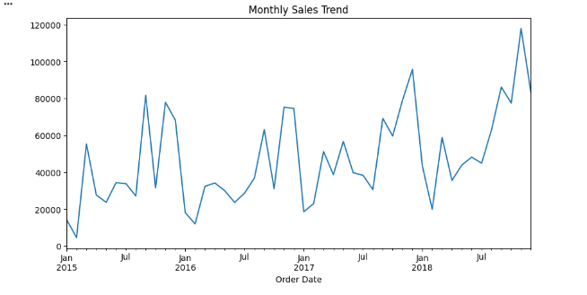

# Retail Sales Analytics Dashboard

Sales performance & customer insights dashboard built on 9,800+ retail transactions using Excel and Power BI.

## Problem

Retail businesses often struggle to identify which regions, product categories, and customer segments drive the most revenue, and how shipping performance affects delivery experience. This project analyzes transaction-level sales data to uncover performance patterns and provide actionable business recommendations.

## Dataset

- **Source:** [Superstore Sales Dataset – Kaggle](https://www.kaggle.com/datasets/rohitsahoo/sales-forecasting)
- **Size:** 9,800+ rows, 18 columns
- **Fields:** Order ID, Order Date, Ship Date, Ship Mode, Customer ID, Segment, Region, City, State, Category, Sub-Category, Product Name, Sales, and more

## Tools Used

- **Excel** – Data cleaning, formatting, calculated columns
- **Power BI** – Dashboard building, visualization, DAX measures
- **Python (pandas, matplotlib)** – Deeper statistical analysis beyond the dashboard

## Data Cleaning Process

- Checked for duplicate records — found and removed **1 duplicate row**
- Checked for missing values — found **13 missing Postal Code entries**; left as-is since analysis is done at Region/State/City level, so it did not impact insights
- Converted Postal Code to text format to preserve leading zeros
- Standardized Order Date and Ship Date formats
- Added calculated columns: **Delivery Days** (Ship Date − Order Date), **Order Month/Year**
- Trimmed extra spaces and checked text consistency across category/location fields

## Dashboard

📄 [View Dashboard PDF](dashboard/SUPERSTORE-DASHBOARD.pdf) (no Power BI needed)
📊 [Download .pbix file](dashboard/SUPERSTORE-DASHBOARD.pbix) (interactive, needs Power BI Desktop)

**Key Metrics:**
| Metric | Value |
|---|---|
| Total Sales | 2.26M |
| Total Orders | 5K |
| Total Customers | 793 |
| Avg Order Value | 459.42 |
| Avg Delivery Days | 3.96 |
| Sales Growth YoY | 46.91% |

## Key Insights

### Sales Trend by Month

- Sales dip in January-February, then climb steadily from March onward
- Clear seasonal peak in September and November-December, indicating strong holiday-driven demand
- 46.91% YoY growth shows healthy overall business momentum

### Sales by Region

- West leads with 0.71M in sales, followed closely by East at 0.67M
- Central (0.49M) and South (0.39M) trail significantly — West generates ~82% more revenue than South
- Suggests West and East are core markets, while Central/South may need focused marketing investment or deeper analysis into why performance lags

### Sales by Category

- Office Supplies leads at 0.83M (36.6%), followed by Furniture at 0.73M (32.2%) and Technology at 0.71M (31.2%)
- Fairly balanced category mix — no single category dominates, meaning diversified revenue streams
- At sub-category level, Phones (328K) and Chairs (325K) are the top revenue drivers individually

### Sales by Segment

- Consumer segment dominates with 1.15M in sales — more than Corporate (0.69M) and Home Office (0.42M) combined
- Consumer-focused strategy is currently driving the business; Corporate segment may be an underleveraged growth opportunity

### Shipping & Delivery Performance
- 59.83% of orders use Standard Class shipping, but it also has the longest average delivery time (5.0 days)
- First Class delivers in 2.2 days on average, Same Day in ~0 days, yet both are used far less
- Most orders fall in the 4-day delivery window, suggesting Standard Class is the default choice for price-sensitive customers even at the cost of speed

## Recommendation

Based on the analysis, marketing and inventory planning should prioritize the West and East regions given their higher revenue contribution, while investigating why Central and South underperform. Since Consumer is the dominant segment, targeted campaigns to grow the Corporate segment (higher average order value potential) could unlock additional revenue. Inventory and staffing should be scaled up ahead of the September and November-December peak periods. Lastly, offering incentives (e.g. slight discounts) to shift more Standard Class customers toward First Class shipping could improve customer satisfaction without major cost increase.

## Additional Analysis (Python)

Beyond the Power BI dashboard, deeper statistical analysis was done using Python (pandas, matplotlib) to uncover patterns not visible in standard visualizations. Full notebook: [`notebooks/analysis.ipynb`](notebook/sales_analysis.ipynb)

### Top 10 Customers by Revenue
Sean Miller is the highest revenue-generating customer ($25,043), followed by Tamara Chand ($19,052) and Raymond Buch ($15,117). These top 10 customers together contribute **6.80%** of total sales revenue ($153,811 out of $2,261,255).

This moderate concentration suggests some dependency on key accounts — while not extreme, it highlights the importance of strong CRM and retention strategies for top clients, while also growing mid-tier customers to reduce over-reliance on a small group.

### Monthly Sales Trend & Growth Rate

The 4-year trend (2015–2018) shows clear seasonality, with sales peaking toward the end of each year (holiday season) and dipping in early months. There's a consistent upward trend overall, with late 2018 recording the highest monthly sales in the dataset — indicating steady year-over-year business growth.

Month-over-month growth rate shows high volatility (e.g. +1121% in March 2015, +200% in September 2015, followed by sharp declines), pointing to strong seasonal and promotional effects rather than steady linear growth. This reinforces the need for demand forecasting aligned with seasonal peaks rather than flat monthly targets.

### Delivery Days vs. Order Value Correlation
Correlation coefficient: **-0.0057** (effectively no relationship)

Delivery time has virtually no impact on how much a customer spends per order. This suggests customers aren't deterred from higher-value purchases by longer shipping times — other factors (product need, brand trust, pricing) likely matter more than delivery speed alone.

### Average Order Value (AOV) by State
Wyoming leads by a wide margin with an AOV of **$1,603**, followed by Vermont ($811.76) — far ahead of the rest of the top 10 (Nevada, Rhode Island, Montana, etc., all under $430).

This is a different lens than total sales by state — a state can have low order volume but high per-transaction value. Wyoming and Vermont represent high-value customer pockets worth targeting for premium offerings or account-based marketing, rather than judging market potential by total revenue alone.
## Author

khalid khilji — Data Analyst
[LinkedIn/Contra profile link]
